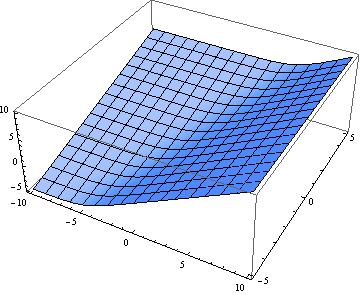

[shader toy效果](https://www.shadertoy.com/view/ltBGzc)

效果解读思考笔记，具体注释请看源码注解

## smooth min
### 背景
  在复杂物体建模中，有些物体难以用隐式函数去描述，这时候我们往往会采用一些简单的物体进行组合，从而拼凑出一个复杂物体，这样的操作称之为 CSG（Constructive solid geometry）构造实体几何，常见的操作手段借助集合我们可以描述为并集，交集，补集

### 问题
  我们在使用并集去处理物体的交界处的时候，通常会得到这样的一个结果

  

  这样看上去似乎达到了我们的效果，但是对于更高的要求时，这样棱角分明的效果显得很突兀，我们希望达到这样的效果

  