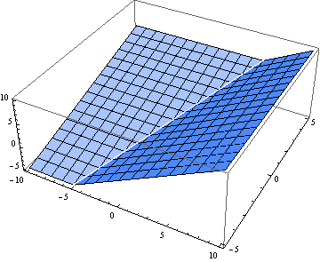

[shader toy效果](https://www.shadertoy.com/view/ltBGzc)

效果解读思考笔记，具体注释请看源码注解

## smooth min
### 背景
  在复杂物体建模中，有些物体难以用隐式函数去描述，这时候我们往往会采用一些简单的物体进行组合，从而拼凑出一个复杂物体，这样的操作称之为 CSG（Constructive solid geometry）构造实体几何，常见的操作手段借助集合我们可以描述为并集，交集，补集

### 问题
  我们在使用并集去处理物体的交界处的时候，通常会得到这样的一个结果

  

  这样看上去似乎达到了我们的效果，但是对于更高的要求时，这样棱角分明的效果显得很突兀，我们希望达到这样的效果

  

### 解决方法
  针对上面的效果，[Inigo Quilez (iq)](https://iquilezles.org/)提出了smooth min的解决办法，假定a，b两值在一个控制点范围内存在相交，控制点范围为 (-k, k)，相交时我们分三种情况讨论
  * a - b < -k
  * a - b > k
  * a - b ∈ (-k, k)

  前两者很好理解，边界值处理，得到的结果是非a则b，我们需要讨论的是第三种情况，在开区间范围内的取值，这里我们直接上公式
  
  <code>
  f(a, b, k) = a + h(b - a), h ∈ [0, 1]
  </code>
  <br />
  <br />
  h取值可以由上述的 -k <= a - b <= k 得出，将-k, k 映射到0, 1，可得
  <br />
  <br />
  <code>
  h = 0.5 + 0.5 * (a - b) / 2k
  </code>
  <br />
  <br />

  接下来我们公式f(a, b, k)进行线性插值，由于h依赖于a，b，而a，b依赖于x，所以我们将公式对x进行求导，取得导数为<br />
  <code>
  df/dx = da/dx + dh/dx * (b - a) + h * (db/dx - da/dx)
  </code>
  <br />
  <br />
  讨论边界情况，a-b = -k与k 时，h分别取得0和1，再获取对应边界情况的导数公式，联立上导数公式与两种边界情况的导数公式，获取修正后的导数公式
  <br/>
  <br />
  `
  df/dx = da/dx + dh/dx * (b - a) + h * (db/dx - da/dx) - k(dh/dx) + 2kh(dh/dx)
  `
  <br />
  <br />
  这样转换成实际的数学公式为
  <br />
  <br />
  <code>
  f(a, b, k) = a + h(b - a) - kh + kh² = a(1 - h) + hb - kh(1 - h)
  </code>
  <br />
  <br />
  最终转换为glsl代码为
  <br />
  ```javascript
  float smin(a, b, k) {<br />
    float h = clamp(0.5 + 0.5 * (a - b) / k, 0.0, 1.0);
    return mix(a, b, h) - k * h * (1.0 - h);<br />
  }
 ```

  > end

  > 笔者对于联立导数公式与边界情况导数公式推导出的修正导数公式存有疑问，不清楚如何得出修正公式([原文出处](http://www.viniciusgraciano.com/blog/smin/))，欢迎各路大神指点
